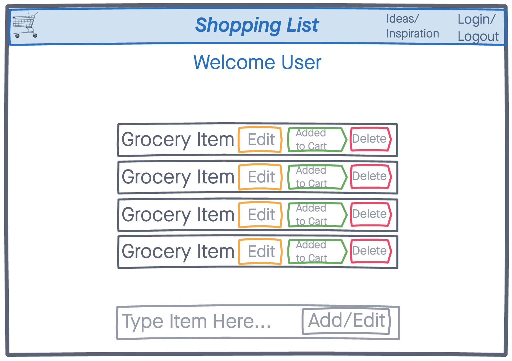
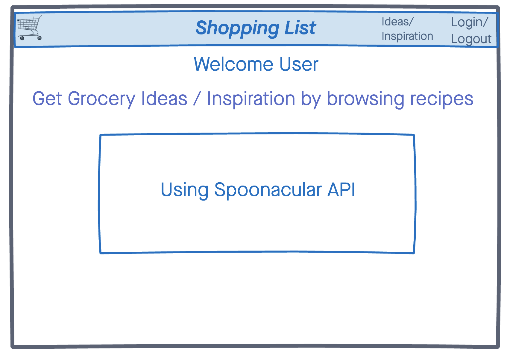
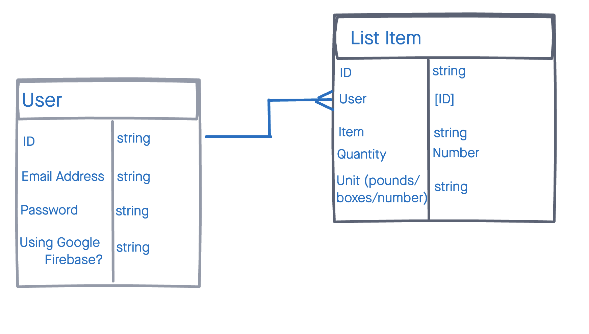
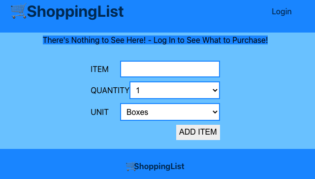
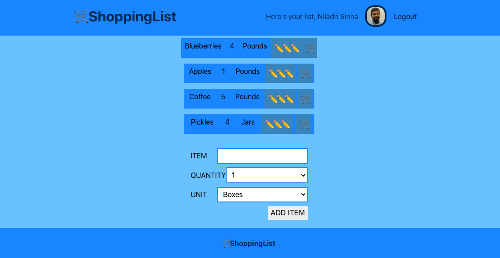

# 🛒ShoppingList

Do you need a list when you go shopping? Do you have a difficult time keeping track of items that you already put in your cart? Or perhaps you tend to lose all the pens you bring with you to cross items off of your list. This app will help!

## Technologies
- MongoDB/Mongoose
- Express
- Node
- React
- CSS3
- JavaScript
- Heroku
- Spoonacular API

## Getting Started
[Click here](https://nils-shopping-list.netlify.app/) 

#### Trello Board
[Click here](https://trello.com/b/mu85xA7a/project-3-trello-board)

## Screenshots
#### Here is the wireframes and ERD.
 

#### Here are some screenshots of the web app.

## Future Enhancements
- Change the styling of a list item added to the cart seperate from deleting the item
- A way to click ingredients listed, and have them added to the shopping list
- A way for a user to customize colors and fonts for their personalization

## Bugs
Things should be running smoothly. If you bump into any errors, send me a note niladri.sinha89@gmail.com